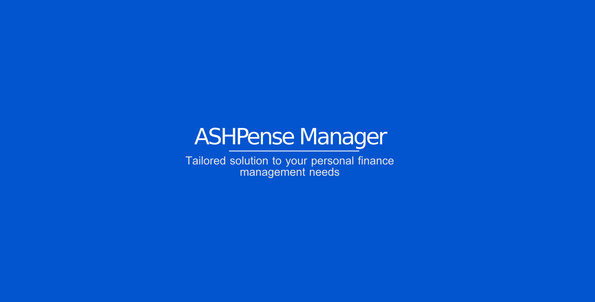
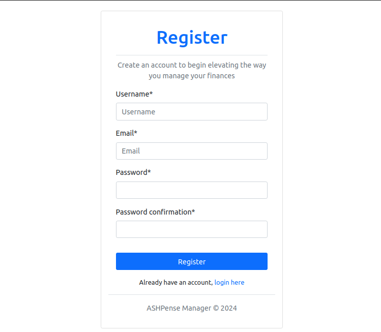
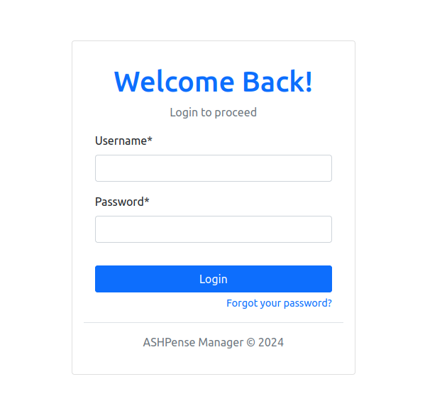
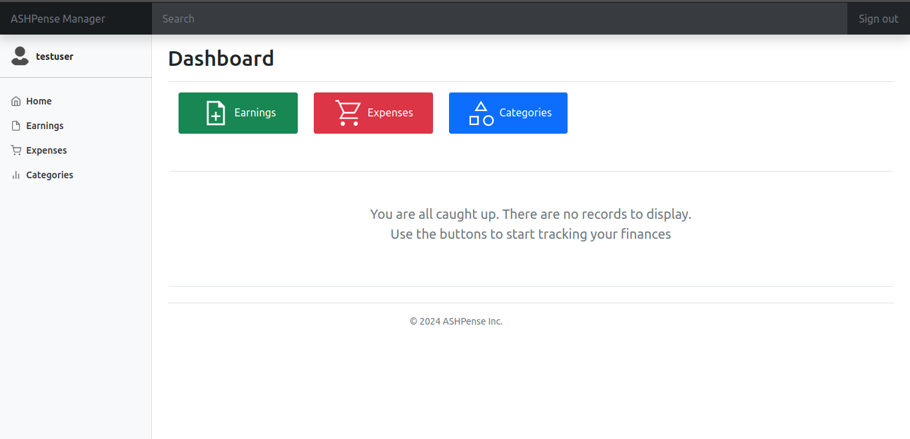
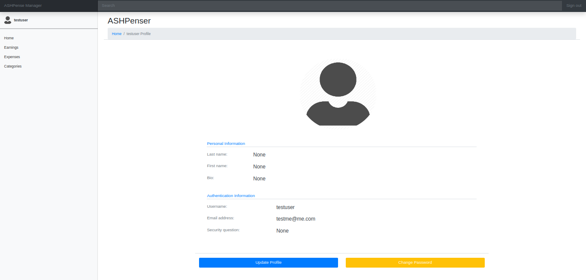
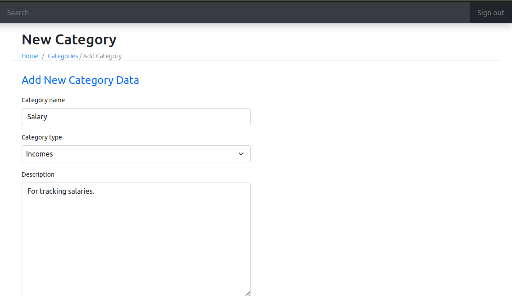

# ASHPense Manager
<a href="https://apm-ashpense-76bd87be6dd5.herokuapp.com/">
    
<a>

## What is ASHPense Manager
[ASHPense Manager]() is a personal finance management platform aimed at helping individuals manage their personal finances effectively. The platform offers features for tracking income earnings and expenses as well as to display a list of all transactions.

## Contents
- [Inspiration](#inspiration)
- [Tech Stack](#tech-stack)
- [Accessing the Platform](#accessing-the-platform)
- [Further Improvement](#further-improvement)
- [Author](#author)
- [Acknoowledgement](#acknowledgement)

## Inspiration
There are numerous mobile applications available for managing personal finances. These apps have several features to enable users to conveniently keep track of their finances, including the ability to backup to the cloud. However, the convenience of the app usage is limited to only the mobile device.

**ASHPense Manager** was born out of the desire to have such a tool accessible on all devices as far as the device has a web browser. A web application boasts of several advantages which the mobile app lacks:
- No need to worry about backing up data as the platform's hosting agent caters for that.
- Platform can be accessed on any device, regardless the operating system.
- Platform can still be accessed in the event the user's device breaks down. There will be no need to reinstall and download backups
- The platform is always up-to-date; there will be no need to install updates and security patches
- Users can also switch between devices and continue using the platform without losing data or their progress.
- Users experience is consistent across different devices as web applications are not dependent on the underlying operating system of the devices they use.

## Tech Stack
ASHPense Manager was built with the following technologies:
### Front-end
- HTML/CSS
- Bootstrap5 (CSS Framework)
- JavaScript

### Back-end
- Python
- Django (Python Web Framework)

### Database
- PostgreSQL

## Accessing the Platform
To access the platform, visit [ASHPense Manager]()
### Signup to create an account

### Login with your registered credentials

### Visit your profile page by clicking on your username at the top left corner

### Update your profile

### Create categories

... and continue to explore!

## Further Improvement
There is more room for improving the features of ASHPense Manager, as well as to incorporate new ones. Some of these improvements are listed as follows:
- The landing page can be improved with more platform features, graphics, and information to vividly capture the essence of ASHPense Manager and to enhance user experience.
- An MFA as well third party authentication features such as OAuth from Google and or Microsoft to enhance user authentication security
- Building activity specific apps such as charts, reports, export and import of data to improve the usability of the platform
- The overall front-end of the dashboard and the various parts are potential areas for improvement to engage users and enhance their usage experience

## Author
[Emmanuel Enchill](https://github.com/Ashdof) is a fullstack software engineer who enjoys working on both back-end and front-end.