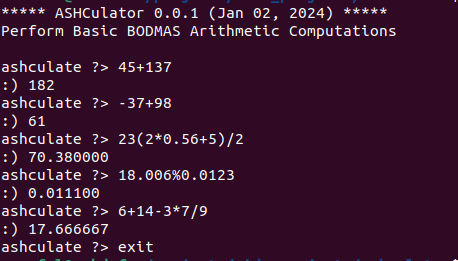
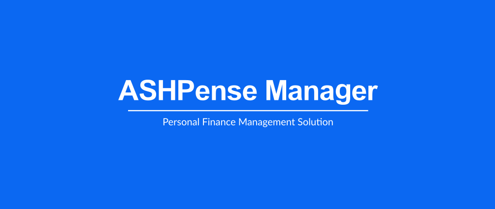

# PORTFOLIO PROJECTS
Welcome! 

 This repository is a collection of projects I build either at my free time or as part of a course I have taken. These projects highlight my skills, capabilities and continuously learning in my quest for professional growth and development. Following are summaries of the projects, with each heading leading to the project's main repository.

## [ASHCulator](https://github.com/Ashdof/side_projects/tree/main/ashculator)

ASHCulator is a console-based calculator that performs simple arithmetic computations. It was developed entirely in C as an excuse to further practice the basic concepts of the language.

## [ASHPense Manager](https://github.com/Ashdof/side_projects/tree/main/apm)

ASHPense Manager is a web application designed to help individuals and small business owners manage their finances more effectively by tracking and monitoring financial transactions. This was a portfolio project which concluded the foundation curriculum during my one-year software engineering training at ALX.