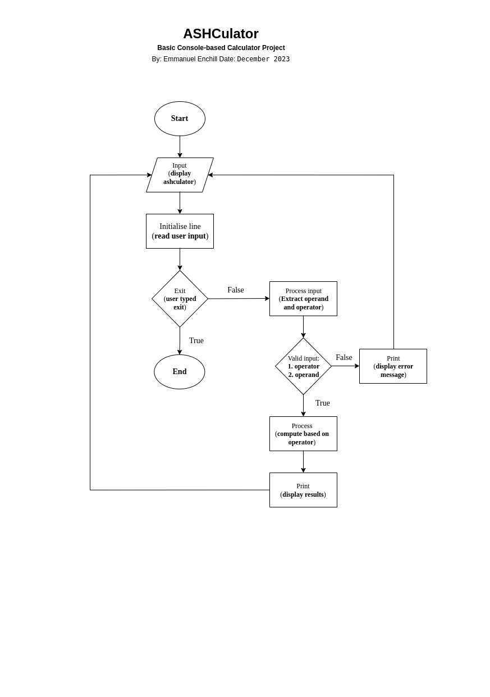
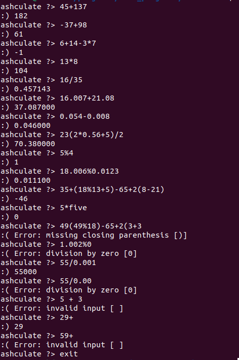

# ASHCULATOR
ASHCulator is a console-based application that performs simple arithmetic computations: *addition, subtraction, multiplication, division and modulo*.

## Compilation and Code Quality
The program was compiled using the **Gnu Compiler Collection (gcc)** program with the following flags:
- ` -Wall -Werror -Wextra -pedantic -std=gnu89 `

- ` Betty Linter ` was used to check the coding style and construct.

## Process
The application executes in a loop. It presents the *ashculator,* **ashculate ?>** to the user for input. When provided with the correct input values, it prints the results **:) <value>** of the computation on the next line. When provided with invalid input, an error message is printed, **:( <error message>.** It quits when the user enters **exit**.

## Flowchart
The following image shows the high level execution process for the application
  

## Execution Demonstration
The screenshot below shows the **ASHCulator** in use to perform basic arithmetic computations.
  

## Issues
Based on the test cases as seen in the execution process image above, no issues were detected at the moment. However, when texts are supplied as operands, it prints zero as the answer, which can be seen from the execution process image. Aside from this, there are currently no known bugs.

## Executing ASHCulator
The program was developed on Ubuntu 22.04 system and has not yet been tested on other operating systems. To run ASHCulator on computer, follow these instructions:
- Clone the repository to your local machine.
- Extract the contents of the file to your desired location.
- Delete the ` ashculate ` object file as that was used for testing purposes.
- Compile the program using ` gcc -Wall -Werror -Wextra -pedantic -std=gnu89 *.c -o ashculate `. You can choose a different name for your object file instead of **ashculate.**
- Execute the program using ` ./ashculate `
- Enjoy

## Reporting Errors/Bugs/Issues
This is a portfolio project, and as an effort to advance my knowledge and experience in the **C Programming Language.** Should you detect any form of bug, kindly message me via any of contacts. Thank you.
