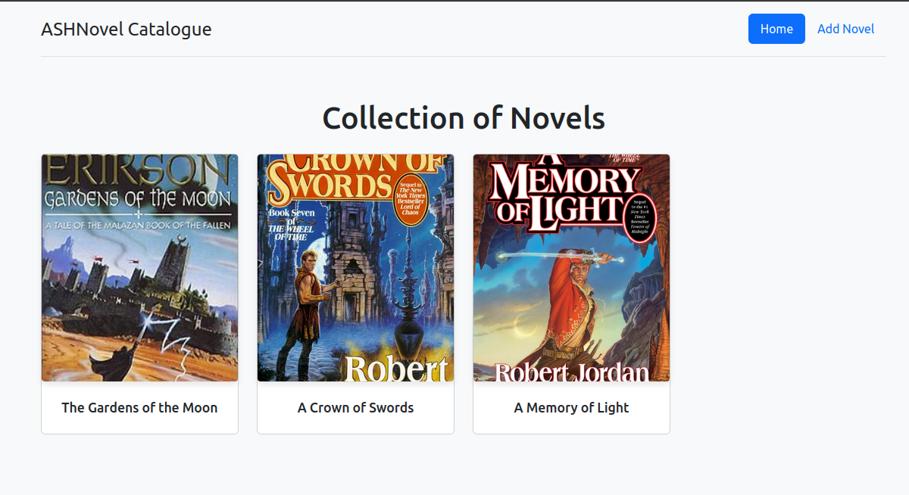

# ASHNOVEL CATALOGUE

A web-based application built using Java Spring MVC for managing a catalogue of novels, authors, and genres. This project demonstrates clean MVC architecture, integration with PostgreSQL, and dynamic views powered by Thymeleaf.

## 📚 Features
- CRUD operations for Novels
- Thymeleaf-powered dynamic HTML views
- PostgreSQL as the relational database
- Hibernate for ORM and entity management

## 🛠️ Tech Stack
- **Backend:** Java, Spring MVC, Hibernate (JPA)
- **Frontend:** Thymeleaf, HTML, CSS
- **Database:** PostgreSQL
- **Build Tool:** Maven
- **IDE:** IntelliJ IDEA Community
- **Server:** Apache Tomcat Servlet

## 🚀 Getting Started

### Prerequisites
- Java 21+
- PostgreSQL
- Maven
- Git

### Clone the Repository
```bash
git clone https://github.com/Ashdof/side_projects/tree/main/ashnovel_catalogue.git
cd ashnovel_catalogue
````

### Database Setup

1. Create a PostgreSQL database:

```sql
CREATE DATABASE novel_catalogue_db;
```

2. Create `application.properties` file with your DB credentials in resources/db directory.

```properties
db.driver=org.postgresql.Driver
db.url=jdbc:postgresql://localhost:5432/novel_catalogue_db
db.username=your_username
db.password=your_password
```

## 🧪 Running the Application

Use your IDE or terminal:

```bash
mvn clean package
```

Visit [http://localhost:8080/ashnovel_catalogue/catalogue/home](http://localhost:8080/ashnovel_catalogue/catalogue/home) to access the app.

---

## 📁 Project Structure

```
src/
├── main/
│   ├── java/
│   │   └── com.enchill_projects.ashnovel_catalogue/
│   ├── resources/
│   │   ├── templates/
│   │   │   └── # Thymeleaf views
│   │   ├── application.properties
│   │   └── db/
            └── db.properties 
```

---

## 📌 Future Enhancements

* User authentication and role-based access
* RESTful API support
* Modular structure implementation for novels and authors.
* Integration with third-party book metadata services

---

## 👤 Author

* Emmanuel Enchill | [LinkedIn](https://www.linkedin.com/in/ariseandshine/) | [GitHub](https://github.com/Ashdof)

## 📄 License
This project is licensed under the MIT License.
