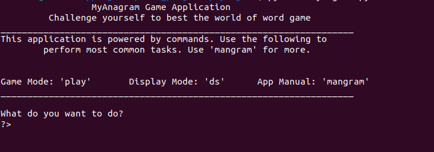
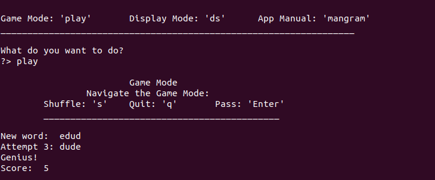
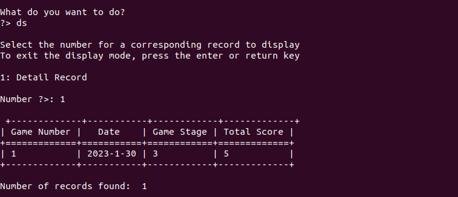
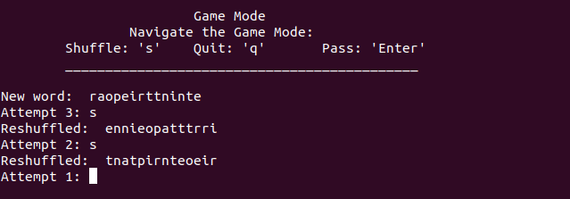

# Anagram Game

This is a word game in which the user is challenged to guess and present the correct spelling of a shuffled word. The user is given `three (3)` chances to attempt guessing the correct word. A correct attempt awards `three (3)` marks and `zero (0)` for an incorrect guessing after the third attempt.

## About the Words

The words used for this project were collected and contributed to the public domain by [Grady Ward](https://en.wikipedia.org/wiki/Grady_Ward) as part of the [Moby Project](https://en.wikipedia.org/wiki/Moby_Project). The list of words were downloaded from [Green Tea Press](https://greenteapress.com/thinkpython/code/words.txt) website. There were initially 113,809 words. For the purpose of this project, words with 3 letters and below were removed. Also, words with repeated first characters were removed. Due to the quantity of the words, the clean up was done by executing the following code:


```
def getwords(filepath):

    word_file = open(filepath, 'r')
    gametext = open('game_one', 'a')

    for word in word_file:
        nword = word.strip()

        if len(nword) > 3:
            if nword[0] != nword[1]:
                gametext.write(word + "\n")

    word_file.close()
    gametest.close()

    print("done!")
```

The `filepath` is the name of the file containing the list of words if it is in the same directory as the file with this python code. If the file is in a different directory, then the absolute path should be provided.

After the cleanup, the number reduced to `21, 251` words, `165,022` characters and of `3,523` pages of an A4 size paper.

## Files in this repository

The following are the files in this repository:

- ` anagram.py file `
This file contains the main function of the program and acts as the interface the user directly ineteracts with

- ` dbclass.py file `
This is a module that directly communicates with the database file. The functions in this file execute activities such as committing records to the database and selecting records for display

- ` gamelogic.py file  `
This file contains the game logic; the methods in this file select words randomly from a file, shuffle the word and present it to the user. The methods also take the user's input through a guess and compare it with the original word. It then awards marks accordingly. The process runs in a loop until a particular condition is met at which the program terminates.

- ` game_words file `
This file contains over 10,000 words which are selected at random and presented to the user for guessing

- ` gamedb.db `
This is an ple SQLite3 database file which stores the records of a game

- ` mangram `
This is a simple text file with instructions on how to navigate the application and the game

## Sections of the app in pitures

``` Application's home page ```
<br /><br /><br />

``` Game mode ```
<br /><br /><br />

``` Display mode ```
<br /><br /><br />

``` Game shuffle ```
<br /><br /><br />

` Enjoy the Game `
