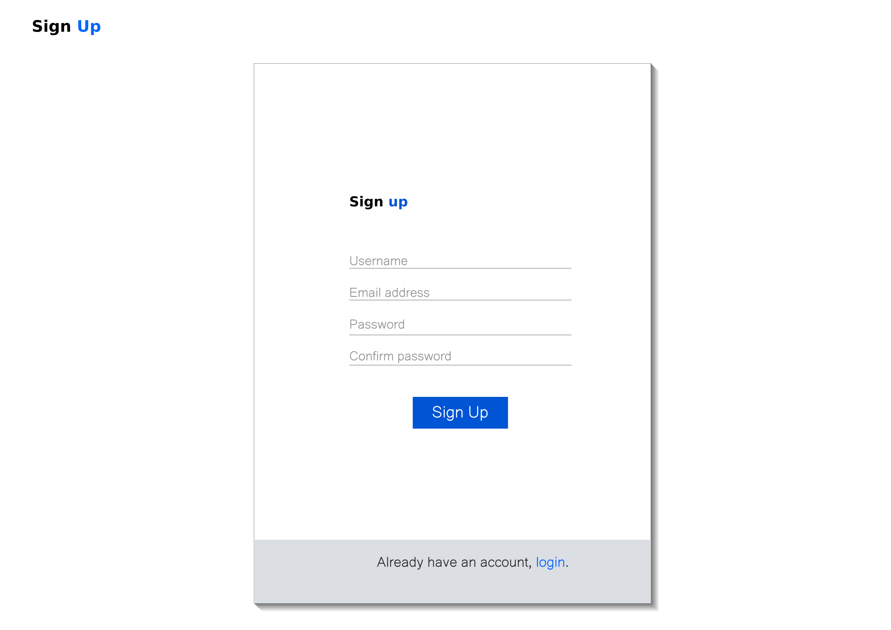
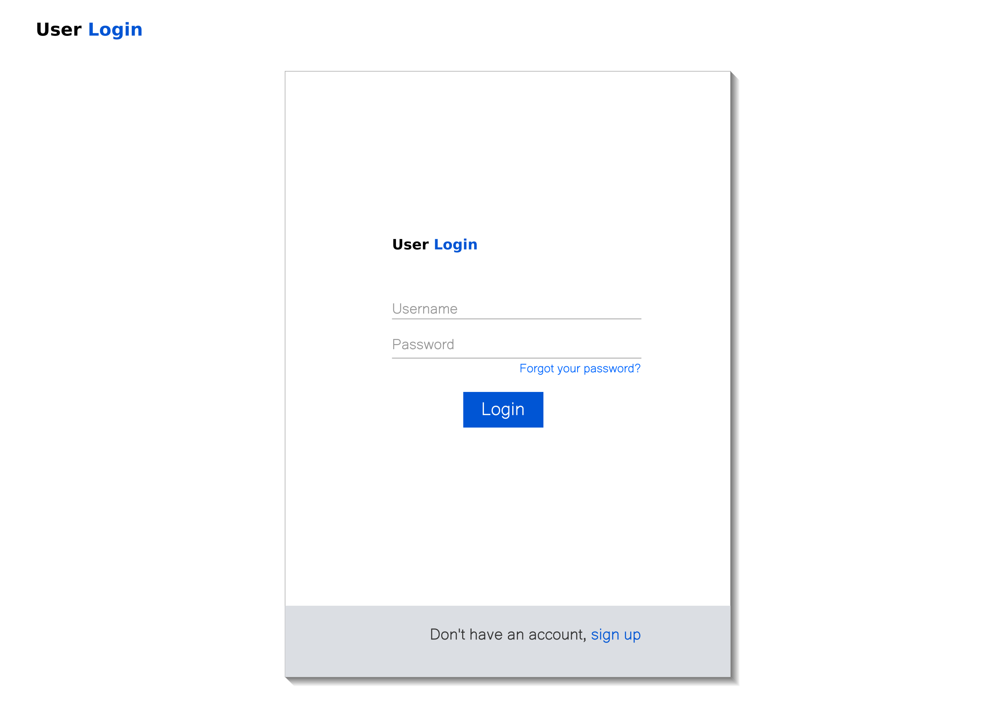
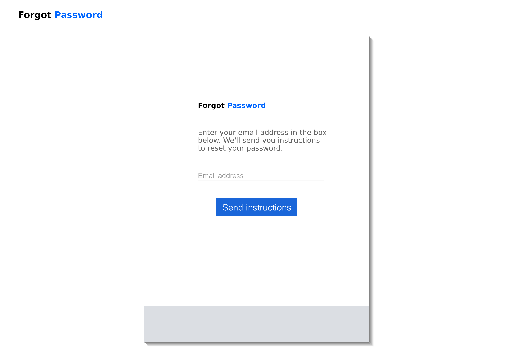
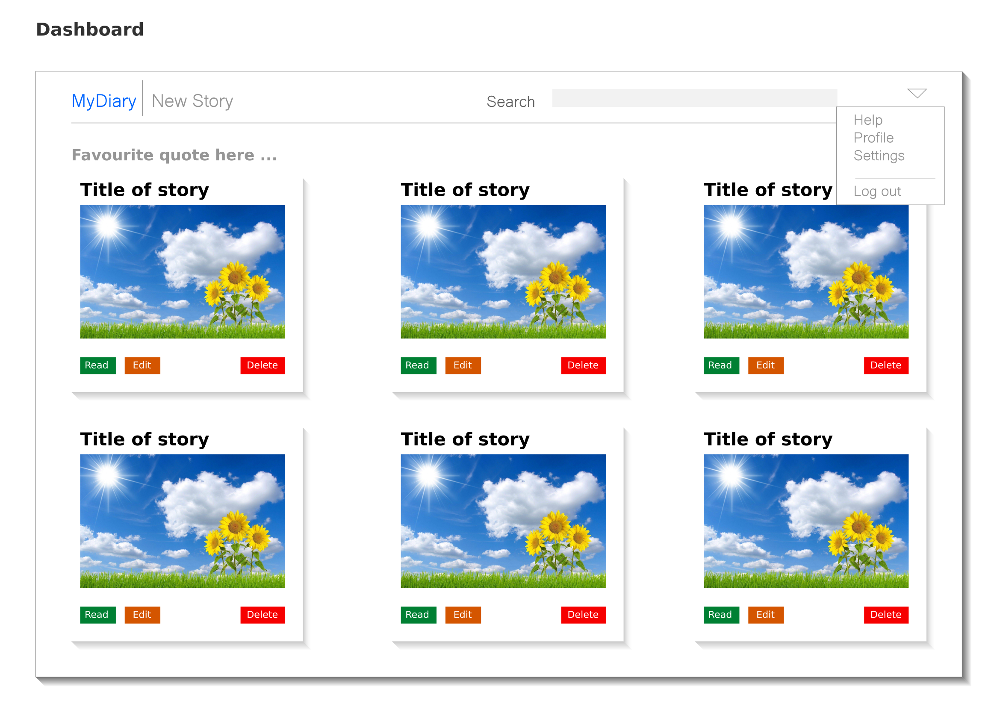
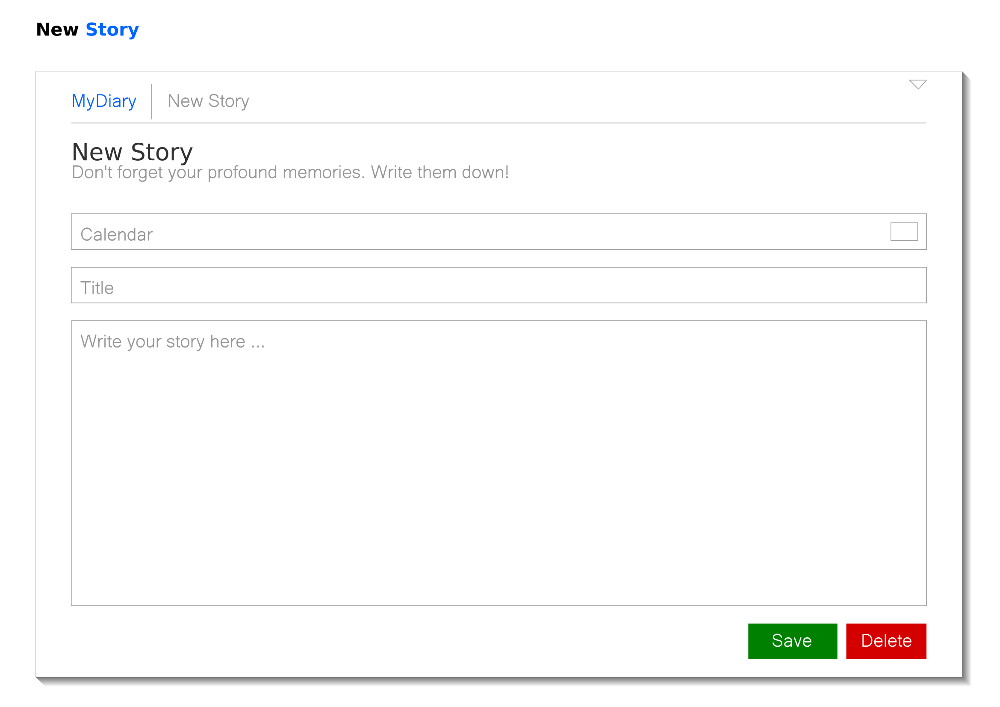
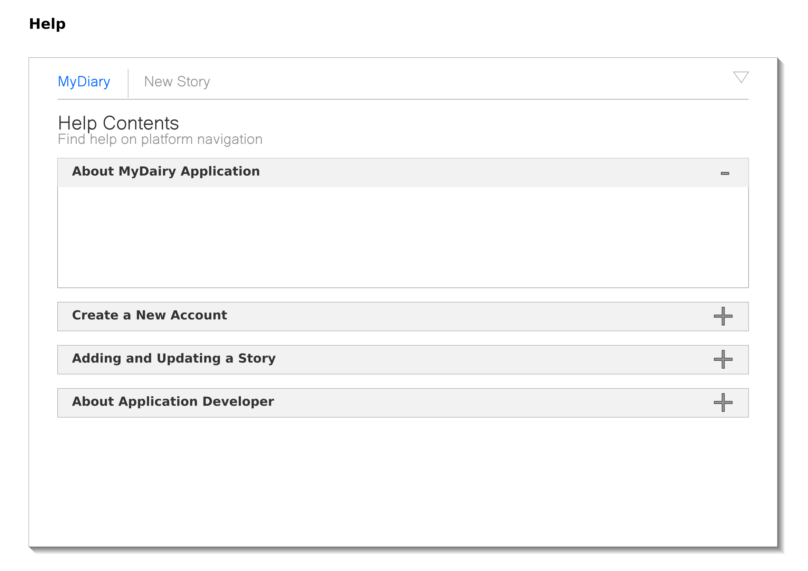
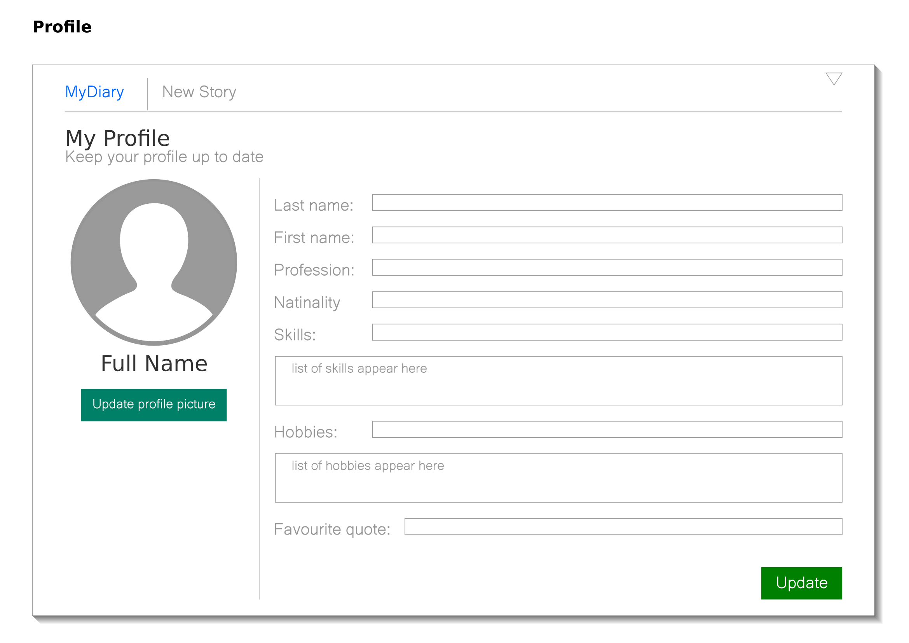
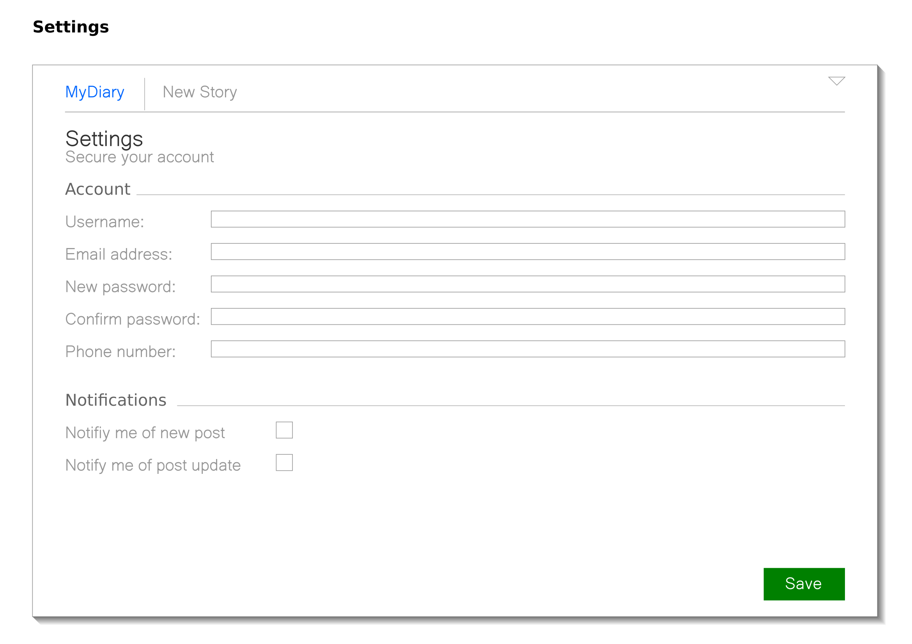

## MyDiary Application

This is a web application powered by Django. MyDiary's main usuage is to create and manage memorable moments or incidents in a person's life. This web application is a part of my portfolio projects to showcase my skills as a fullstack developer.

---

## :hammer_and_wrench: Tools and Technologies
&nbsp;
&nbsp;
&nbsp;
&nbsp;
&nbsp;
&nbsp;
&nbsp;
&nbsp;

### IDEs
&nbsp;
&nbsp;

---
## Application Development Timeline
This describes the process I used to create the application.

### Requirements Analysis
The project began with the analysis of requirements and specifications of the system. As a web application, it will be accessed mainly on mobile phones, tablets, laptops and desktop computers. 

**Usuage Requirements**
The application will require users to be authenticated anytime they want to access the platform. The user must therefore create an account with the system before proceeding with anything else.

**Typical Execution Process**
For a user accessing the platform for the first time, the typical process follows the steps below:

- User accesses the main page with the platform's domain address
- User clicks on **sign up** which brings up the sign up page
- User provides *username, email address, password* and confirms *password*
- Login instructions are sent to the provided email aaddress
- Using the link provided in the instructions, user accesses the platform’s **login** page
- User provides username and password to login
- If successful, user lands on the application’s **dashboard**

### System Design
At this stage, I converted the specifications and requirements into layout designs, showing where buttons, textboxes, textfields, and other widgets will be placed on the platform. Also, colours and how the platform's various parts can be accessed through navigation. The following screen shots show the designs of the major parts of the application.

**Sign up page** 
 

**Login page** 
 

**Forgot password page** 
 

**Dashboard** 
 

**New story page** 
 

**Help page** 
 

**Profile page** 
 

**Settings page** 
 

### Application Development
The next stage in the timeline is development of the platform. At this stage, I turned the design layouts, system requirements and specifications into source code using the specified tools and technologies for the project.

### Testing and Deployment
The final stage in the development timeline is testing the completed platform to ensure it produces the expected output. Finally, the platform was deployed Heroku for the world to see.

*Note:*
**The link of the platform will be shared when development is complete**

---
## Application Domains
This section describes the various parts of the platform
