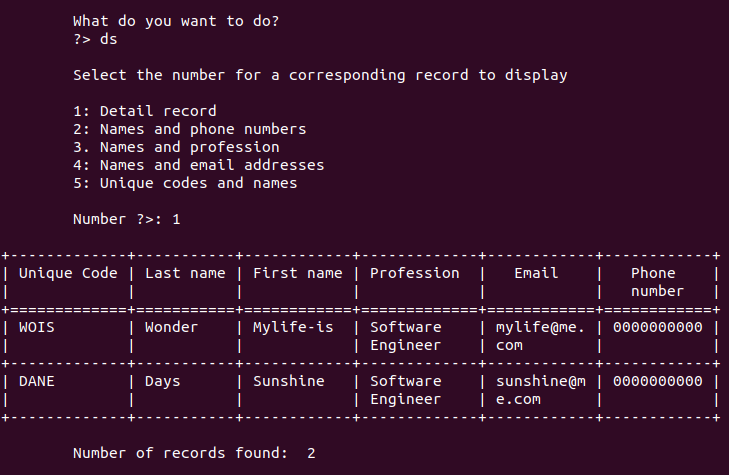
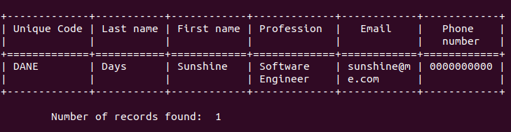

# TactApplication

This is a simple commandline based application for storing the contact information of people in my professional network. This project is part of a collection of projects that make up my portfolio.

## About TactApplication
TactApplication is the imporved version of MyProNetwork Application. This version exploits some advanced Python features for its enhancement.

## Application structure
The main module of the application is the ` tactapp.py ` file. The ` applogic ` directory contains all the other modules a sub-directory for the SQLite database file.

## Files in applogic directory
- ` dbase ` This is a subdirectory that contains the SQLite database file

- ` dbmanager.py ` This module has a single class and numerous methods for executing CRUD (` CREATE, RECORD, UPDATE, DELETE `) operations directly on the database. It acts as the glue between the database and the module that interacts directly with the user

- ` tacthome.py ` This module serves as the main page for the application. The user can access this module only after a successful sign in process. This module receives user input and requests an appropriate method from the user interaction module for a response. 

- ` tactication.py ` This module has various methods to assist the user to register and login into the application in order to start using it. It also responds to requests from the user interaction module

- ` tactuser.py ` This is the user interaction module. The numerous methods in this module requests inputs from the user based on a particular activity to perform. It then contacts the ` dbmanager module ` or the ` tactication module ` for a response to the user's request. 

- ` tactroot ` This is a partially developed module to provide background processes to the application. It is hoped to fully developed in the next development phase.

- ` img ` A collection of png files for the display of the various sections of the application.

## Sections of the application in pictures
The following screenshots are sections of the application as it executes in my terminal.

- ``` Singup section ```
<br /><br /><br />

- ``` Login section ```
<br /><br /><br />

- ``` Home section ```
<br /><br /><br />

- ``` Add new contact section ```
<br /><br /><br />

- ``` Detail records section ```
<br /><br /><br />

- ``` Delete section ```
<br /><br /><br />

- ``` After delete section ```
<br /><br /><br />

## Downside
The application is able to execute normally but has the following identified flaws

- ``` Singin section ```
<br /> Although the a user can signup by providing the firstname, username and password, the signin section fails to validate the user before bringing up the main the page. The user can therefore provide false information (information other than the one used to signup) and the application will still proceed to bring up the main page as if the login data provided were all the right data.

- ``` Update data section ```
<br />To update a record, the user must provide the first and the last names of the record. The system will use this to fetch the specified contact's id. Then, the user will be reuqest to provide which part of the record to update, either first name, last name, profession or even a combination of one or more. But the application can at the moment update only one part of the record. Also, the algorithm for this part is not intuitive enough. Therefore, this section of the application requires a total groundup development to better define its goal

<br />Finally, the application has not been extensively tested and it is possible for several bugs, aside those discussed above to be present. This is still a work in progress and it is developer's intention to use it to aid in his continual development learning and improvement. 